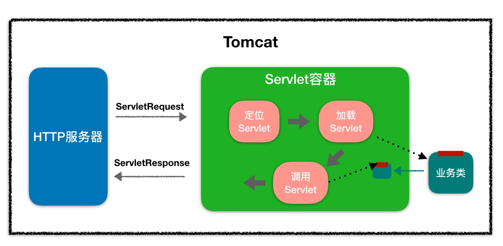
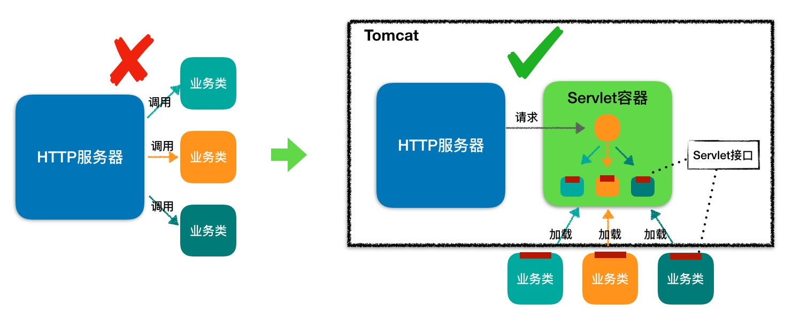

### Servlet接口

各种业务必须都实现这个接口，我们把实现了 Servlet 接口的业务类叫做 Servlet。

### Servlet容器

#### 工作流程
<div align="center">  </div><br>

Servlet 容器用来加载和管理业务类。HTTP 服务器不直接和业务类打交道，而是把请求交给Servlet 容器去处理，Servlet 会将请求转发到具体的 Servlet，如果这个Servlet 还没创建，就加载并实例化这个 Servlet ，然后调用这个 Serrvlet 的接口方法。

因此 Servlet 接口其实是 Servlet 容器跟具体业务类之间的接口。

<div align="center">  </div><br>

图的左边表示HTTP服务器直接点调用具体业务类，它们是紧耦合的。再看图的右边，HTTP服务器不直接调用业务类，而是把请求交给容器来处理，容器通过Servlet接口调用业务类。因此Servlet接口和Servlet容器的出现，达到了HTTP服务器与业务类解耦的目的。

而 Servlet接口和Servlet容器这一整套规范叫作Servlet规范。Tomcat和Jetty都按照Servlet规范的要求实现了Servlet容器，同时它们也具有HTTP服务器的功能。

而作为程序员，如果我们要实现新的业务功能，只需实现一个Servlet，并把它注册到Tomcat（Servlet容器）中，剩下的事情就由Tomcat帮我们处理了。

##### Servlet生命周期
<div align="center">  </div><br>

其中最重要的是service方法，具体业务类在这个方法里实现处理逻辑。这个方法有两个参数：ServletRequest 和 ServletResponse 。ServletRequest 用来封装请求信息，ServletResponse用来封装响应信息，因此本质上这两个类是对通信协议的封装。

比如：
	HTTP协议中的请求和响应就是：
	==HttpServletResquest ---> ServletRequest
	HttpServletResponse ---> ServletResponse==
	
你可以通过这两个类获取所有请求或响应的相关的信息，包括请求路径、Cookie、HTTP头、请求参数、创建和获取Session等。

Servlet容器在加载Servlet类的时候会调用 init 方法，在卸载的时候会调用 destory 方法。我们可能会在 init 方法里初始化一些资源，并在 destory 方法里释放这些资源，比如在 SpringMVC中的 DispatcherServlet，就是在 init	方法里创建了自己的 Spring容器。


### Web应用

Servlet 容器会实例化和调用 Servlet，那Servlet是怎么注册到Servlet容器中的呢？一般来说，我们是以Web应用程序的方式部署Servlet的，而根据Servlet规范，Web应用程序有一定的目录结构，在这个目录下分别放置了Servlet的类文件、配置文件以及静态资源，Servlet容器通过读取配置文件，就能找到并加载Servlet。Web应用的目录结构大概是下面这样的：

``` javascript
| -  MyWebApp
      | -  WEB-INF/web.xml        -- 配置文件，用来配置 Servlet 等
      | -  WEB-INF/lib/           -- 存放 Web 应用所需各种 JAR 包
      | -  WEB-INF/classes/       -- 存放你的应用类，比如 Servlet 类
      | -  META-INF/              -- 目录存放工程的一些信息
```

Servlet 规范里定义了 ServletContext 这个接口来对应一个Web应用。Web应用部署好后，Servlet 容器在启动时会加载 Web应用，并为每个Web应用创建唯一的 ServletContext 对象。你可以把 ServletContext 看成是一个全局对象，一个Web应用可能有多个 Servlet ，这些 Servlet 可以通过全局的 ServletContext 来共享数据，这些数据包括 Web 应用的初始化参数、Web 应用目录下的文件资源等。由于 ServletContext 持有所有 Servlet 实例，你还可以通过它来实现 Servlet 请求的转发。


#### 扩展机制

Servlet 规范提供了两种扩展机制：Filter 和 Listener。

==Filter==是过滤器，这个接口允许你对请求和响应做一些统一的定制化处理。
Filter是干预过程的，它是过程的一部分，是基于过程行为的。

==Listener==是监听器，这是另一种扩展机制。当Web应用在Servlet容器中运行时，Servlet容器内部会不断的发生各种事件，如Web应用的启动和停止、用户请求到达等。Servlet容器提供了一些默认的监听器来监听这些事件，当事件发生时，Servlet容器会负责调用监听器的方法。比如Spring就实现了自己的监听器，来监听 ServletContext 的启动事件，目的是当 Servlet 容器启动时，创建并初始化全局的 Spring 容器。
Listener是基于状态的，任何行为改变同一个状态，触发的事件是一致的。

### servlet容器，web容器，spring容器，springmvc容器的区别

<div align="center">  </div><br>
web容器中有servlet容器，spring项目部署后存在spring容器和springmvc容器。其中spring控制service层和dao层的bean对象。springmvc容器控制controller层bean对象。servlet容器控制servlet对象。项目启动是，首先 servlet初始化，初始化过程中通过web.xml中spring的配置加载spring配置，初始化spring容器和springmvc容器。待容器加载完成。servlet初始化完成，则完成启动。
HTTP请求到达web容器后，会到达Servlet容器，容器通过分发器分发到具体的spring的Controller层。执行业务操作后返回结果。


### Tomcat系统架构

从高到低依次：server --> service --> servlet容器 --> servlet

